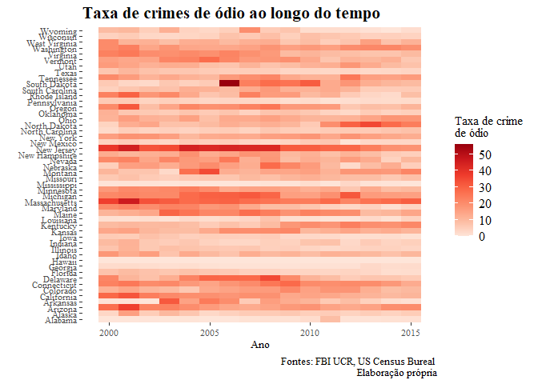

Crimes de ódio nos EUA ao longo do tempo
================
Mohammed Kaebi

``` r
library(tidyverse)
library(ggthemes)
library(hrbrthemes)
library(highcharter)
library(ExPanDaR)
library(maps)
library(mapproj)
library(viridis)
library(ggridges)
library(ggExtra)
```

# Dados

Dados obtidos do **FBI Uniform Crime Reports**.

``` r
load("database.RData")
```

# Ridgeline dos crimes de ódio por estado

``` r
## tabela auxiliar
df <-
  summarySE(painel,
            measurevar = "crime_odio_per500k",
            groupvars = c("state", "region")) # médias por estado
yearagg.df <-
  aggregate(data = df, crime_odio_per500k ~ region, mean) # médias por região
detach("package:plyr", unload = TRUE)

x <- painel %>%
  select(state, crime_odio_per500k) %>%
  group_by(state) %>%
  summarise(median_crime = median(crime_odio_per500k)) # tabela com as médias por estado

x <- arrange(x, median_crime) # ordenação com base na média

painel2 <- painel # tabela auxiliar

painel2$state <-
  factor(painel2$state,
         levels = unique(x$state),
         ordered = TRUE) # reordena o fator estado com base na ordem das médias da tabela x
painel2$state <- fct_rev(painel2$state) # inverte a ordem
```

## Não separado por região

``` r
filter(painel2, year %in% c(2000:2015)) %>%
  ggplot(aes(x = crime_odio_per500k, y = state, fill = ..x..)) +
  geom_density_ridges_gradient(
    quantile_lines = TRUE,
    quantiles = 2,
    scale = 3,
    rel_min_height = 0.005
  ) +
  geom_vline(
    data = df,
    aes(xintercept = mean(crime_odio_per500k)),
    color = "tomato2",
    linetype = "dashed",
    size = 1
  ) +
  scale_fill_viridis(option = "C") +
  theme_minimal(base_family = "Roboto Condensed") +
  labs(
    x = "Taxa de crimes de ódio (crimes de ódio por 500 mil habitantes)",
    y = "",
    title = "Distribuição dos crimes de ódio por estado (2000 a 2015)",
    caption = "Fontes: FBI UCR, US Census Bureal \nElaboração própria"
  ) +
  theme(
    axis.title = element_text(size = 10),
    axis.text = element_text(size = 7),
    plot.title = element_text(size = 16, face = "bold"),
    plot.subtitle = element_text(size = 14),
    plot.caption = element_text(size = 10),
    legend.position = "none",
    panel.grid.major.x = element_blank(),
    panel.grid.major.y = element_line(colour = "grey85", linetype = "solid"),
    axis.ticks.y = element_blank(),
    panel.grid = element_blank()
  )+
  scale_x_continuous(expand = c(0, 0))
```

<!-- -->

## Separado por região

``` r
labels.region <-
  c(
    "North Central" = "Região: Centro Norte",
    "Northeast" = "Região: Nordeste",
    "South" = "Região: Sul",
    "West" = "Região: Oeste"
  )

filter(painel2, year %in% c(2000:2015)) %>%
  ggplot(aes(x = crime_odio_per500k, y = state, fill = ..x..)) +
  geom_density_ridges_gradient(
    quantile_lines = TRUE,
    quantiles = 2,
    scale = 3,
    rel_min_height = 0.005
  ) +
  facet_wrap(
    ~ region,
    nrow = 2,
    ncol = 2,
    "free",
    labeller = labeller(region = labels.region)
  ) +
  geom_vline(
    data = yearagg.df,
    aes(xintercept = crime_odio_per500k),
    color = "tomato2",
    linetype = "dashed",
    size = 1
  ) +
  scale_fill_viridis(name = painel2$crime_odio_per500k, option = "C") +
  theme_tufte() +
  labs(
    x = "Taxa de crimes de ódio (crimes de ódio por 500 mil habitantes)",
    y = "",
    title = "Distribuição dos crimes de ódio por estado (2000 a 2015)",
    caption = "Fontes: FBI UCR, US Census Bureal \nElaboração própria"
  ) +
  theme(
    axis.title = element_text(size = 10),
    axis.text = element_text(size = 8),
    plot.title = element_text(size = 16, face = "bold"),
    plot.subtitle = element_text(size = 14),
    plot.caption = element_text(size = 10),
    legend.position = "none",
    strip.text.x = element_text(size = 12, face = "bold"),
    panel.grid.major.y = element_line(colour = "grey80", linetype = "dashed"),
    axis.ticks.y = element_blank()
  )
```

<!-- -->

# Heatmap dos crimes de ódio por estado ao longo do tempo

## Não separado por região

``` r
filter(painel, year %in% c(2000:2015)) %>%
  ggplot(aes(x = year, y = state, fill = crime_odio_per500k)) +
  geom_tile() +
  scale_fill_distiller(name = "Taxa de crime \nde ódio",
                       palette = "Reds",
                       direction = 1) +
  labs(
    x = "Ano",
    y = "",
    title = "Taxa de crimes de ódio ao longo do tempo",
    caption = "Fontes: FBI UCR, US Census Bureal \nElaboração própria"
  ) +
  theme_tufte() +
  theme(
    axis.title = element_text(size = 10),
    axis.text = element_text(size = 8),
    plot.title = element_text(size = 16, face = "bold"),
    plot.subtitle = element_text(size = 14),
    plot.caption = element_text(size = 10),
    legend.text = element_text(size = 12)
  )
```

<!-- -->

## Separado por região

``` r
filter(painel, year %in% c(2000:2015)) %>%
  ggplot(aes(x = year, y = state, fill = crime_odio_per500k)) +
  geom_tile() +
  facet_wrap(
    ~ region,
    nrow = 2,
    ncol = 2,
    "free",
    labeller = labeller(region = labels.region)
  ) +
  scale_fill_distiller(name = "Taxa de crime \nde ódio",
                       palette = "Reds",
                       direction = 1) +
  labs(
    x = "Ano",
    y = "",
    title = "Taxa de crimes de ódio ao longo do tempo",
    caption = "Fontes: FBI UCR, US Census Bureal \nElaboração própria"
  ) +
  theme_tufte() +
  theme(
    axis.title = element_text(size = 10),
    axis.text = element_text(size = 8),
    axis.text.x = element_text(angle = 90),
    plot.title = element_text(size = 16, face = "bold"),
    plot.subtitle = element_text(size = 14),
    plot.caption = element_text(size = 10),
    legend.text = element_text(size = 12),
    strip.text.x = element_text(size = 12, face = "bold")
  ) +
  scale_x_continuous("Ano", breaks = c(2000, 2002, 2004, 2006, 2008, 2010, 2012, 2014))
```

<!-- -->

# Comparação entre as médias da taxa de crimes de ódio em dois períodos

``` r
zz <- select(painel, year, state, region, crime_odio_per500k)

z <- filter(zz, year %in% c(2000:2007))
z <- z %>%
  group_by(state) %>%
  dplyr::summarize(mean_crime = mean(crime_odio_per500k, na.rm = TRUE))
z <- left_join(z, states, by = "state")
z <- mutate(z, periodo = str_c("2000 a 2007"))

w <- filter(zz, year %in% c(2008:2015))
w <- w %>%
  group_by(state) %>%
  dplyr::summarize(mean_crime = mean(crime_odio_per500k, na.rm = TRUE))
w <- left_join(w, states, by = "state")
w <- mutate(w, periodo = str_c("2008 a 2015"))

ggplot() +
  geom_segment(
    data = z,
    x = z$mean_crime,
    xend = w$mean_crime,
    y = z$state,
    yend = z$state,
    color = ifelse(z$mean_crime < w$mean_crime, 'royalblue3', 'tomato3'),
    linetype = ifelse(z$mean_crime < w$mean_crime, 'solid', "dashed"),
    size = 1,
    alpha = 0.7
  ) +
  geom_point(
    data = z,
    aes(
      x = mean_crime,
      y = reorder(state, -mean_crime),
      shape = periodo
    ),
    size = 2,
    fill = "violetred"
  ) +
  geom_point(
    data = w,
    aes(
      x = mean_crime,
      y = reorder(state, -z$mean_crime),
      shape = periodo
    ),
    size = 2,
    fill = "seagreen2"
  ) +
  facet_wrap(
    ~ region,
    nrow = 2,
    ncol = 2,
    scales = "free",
    labeller = labeller(region = labels.region)
  ) +
  scale_shape_manual(name = "Período",
                     values = c("2000 a 2007" = 21, "2008 a 2015" = 22)) +
  labs(
    x = "Média da taxa de crimes de ódio (crimes de ódio por 500 mil habitantes)",
    y = "",
    title = "Comparação da média de dois períodos",
    caption = "Fontes: FBI UCR, US Census Bureal \nElaboração própria"
  ) +
  theme_tufte() +
  theme(
    axis.title = element_text(size = 10),
    axis.text = element_text(size = 8),
    plot.title = element_text(size = 16, face = "bold"),
    plot.subtitle = element_text(size = 14),
    plot.caption = element_text(size = 10),
    legend.text = element_text(size = 12),
    panel.grid.major.y = element_line(colour = "grey80", linetype = "dashed"),
    axis.ticks.y = element_blank(),
    strip.text.x = element_text(size = 12, face = "bold"),
    axis.line=element_line()
  )+
  scale_x_continuous(limits=c(0,42))
```

<!-- -->

# Tipos de vieses

## 1

``` r
tipos_vieses <- db %>%
  group_by(main_bias) %>%
  summarize(freq_abs = n()) %>%
  mutate(freq_rel = freq_abs / sum(freq_abs) * 100)

tipos_vieses <-
  tipos_vieses[order(tipos_vieses$freq_rel, decreasing = TRUE), ] # deixa em ordem decrescente com relação à freq_rel

#### Gráfico das frequencias relativas de cada tipo de vies ao longo de todo o perído
ggplot(data = tipos_vieses,
       mapping = aes(
         x = reorder(main_bias, freq_rel),
         y = freq_rel,
         fill = main_bias
       )) +
  geom_point(
    stat = "identity",
    size = 4,
    alpha = 0.7,
    color = "tomato"
  ) +
  geom_segment(aes(
    x = reorder(main_bias, freq_rel),
    xend = reorder(main_bias, freq_rel),
    y = 0,
    yend = freq_rel
  )) +
  coord_flip() +
  labs(
    x = "Tipo do viés",
    y = "Frequência relativa (%)",
    title = "Quais os viéses mais frequentes de crimes de ódio?",
    subtitle = "Ao longo dos anos de 1991 a 2018",
    caption = "Fonte: FBI Uniform Crime Reporting Data"
  ) +
  theme_minimal(base_family = "Roboto Condensed") +
  theme(
    axis.title = element_text(size = 10),
    axis.text = element_text(size = 8),
    plot.title = element_text(size = 16, face = "bold"),
    plot.subtitle = element_text(size = 14),
    plot.caption = element_text(size = 10),
    legend.position = "none",
    panel.grid.major.x = element_blank(),
    panel.grid.major.y = element_line(colour = "grey85", linetype = "solid"),
    axis.ticks.y = element_blank(),
    panel.grid = element_blank()
  )
```

<!-- -->

## 2 - Principais

``` r
#### Formato 1
tipos_vieses_ano <- db %>%
  group_by(main_bias, year) %>%
  summarize(freq_abs = n())

tipos_vieses_ano <-
  mutate(ungroup(tipos_vieses_ano), freq_rel = freq_abs / sum(freq_abs) * 100)

tipos_vieses_ano <-
  tipos_vieses_ano[order(tipos_vieses_ano$year, decreasing = FALSE), ]


#### Formato 2
tipos_vieses_ano2 <- db %>%
  group_by(year, main_bias) %>%
  summarise(freq_abs_ano = n()) %>%
  mutate(freq_rel_ano = freq_abs_ano / sum(freq_abs_ano) * 100)

filter(
  tipos_vieses_ano2,
  main_bias %in% c(
    "anti-black",
    "anti-jewish",
    "anti-white",
    "anti-male homosexual (gay)",
    "anti-hispanic",
    "anti-ethnicity other than hispanic"
  )
) %>%
  ggplot() +
  geom_area(
    mapping = aes(x = year, y = freq_rel_ano, fill = main_bias),
    alpha = 0.7,
    color = 'black'
  ) +
  labs(
    x = "Ano",
    y = "Frequência relativa (%)",
    title = "Evolução da participação dos principais tipos de viéses em crimes de ódio",
    caption = "Fonte: FBI Uniform Crime Reporting Data"
  ) +
  theme_tufte() +
  guides(fill = guide_legend(title = "Tipo do viés")) +
  scale_x_continuous(breaks = tipos_vieses_ano2$year) +
  theme(legend.text = element_text(size = 10),
        axis.text = element_text(size = 8),
        axis.text.x = element_text(angle = 90))
```

<!-- -->

# Média dos crimes de ódio por estado

## Não separado por região

``` r
df <-
  summarySE(painel,
            measurevar = "crime_odio_per500k",
            groupvars = c("state", "region")) # médias por estado
yearagg.df <-
  aggregate(data = df, crime_odio_per500k ~ region, mean) # médias por região
detach("package:plyr", unload = TRUE)

ggplot(df, aes(
  x = crime_odio_per500k,
  y = reorder(state, crime_odio_per500k) ,
  color = region
)) +
  geom_point(size = 4, alpha = 0.7) +
  geom_vline(
    data = df,
    aes(xintercept = mean(crime_odio_per500k)),
    color = "tomato2",
    linetype = "dashed",
    size = 1
  ) +
  geom_segment(aes(
    x = 0,
    xend = crime_odio_per500k,
    y = reorder(state, crime_odio_per500k),
    yend = reorder(state, crime_odio_per500k)
  )) +
  labs(
    x = "Média do número de crimes de ódio por 500 mil habitantes",
    y = "",
    title = "Heterogeneidade entre estados",
    subtitle = "Anos: 1991 a 2018",
    caption = "Fontes: FBI UCR, US Census Bureal"
  ) +
  theme_minimal(base_family = "Roboto Condensed") +
  theme(
    axis.title = element_text(size = 10),
    axis.text = element_text(size = 8),
    plot.title = element_text(size = 16, face = "bold"),
    plot.subtitle = element_text(size = 14),
    legend.text = element_text(size = 12),
    legend.position = "right",
    plot.caption = element_text(size = 10)
  ) +
  guides(color = guide_legend(title = "Região")) +
  scale_color_discrete(
    breaks = c("North Central", "Northeast", "South", "West"),
    labels = c("Centro Norte", "Nordeste", "Sul", "Oeste")
  )
```

<!-- -->

## Separado por região

``` r
ggplot(df, aes(
  x = crime_odio_per500k,
  y = reorder(state, crime_odio_per500k) ,
  color = region
)) +
  geom_point(size = 3, alpha = 0.7) +
  geom_errorbar(aes(xmin = crime_odio_per500k - se, xmax = crime_odio_per500k +
                      se)) +
  facet_wrap(~ region, nrow = 4, ncol = 1, "free_y") +
  geom_vline(
    data = yearagg.df,
    aes(xintercept = crime_odio_per500k),
    color = "tomato2",
    linetype = "dashed",
    size = 1
  ) +
  geom_segment(aes(
    x = 0,
    xend = crime_odio_per500k,
    y = reorder(state, crime_odio_per500k),
    yend = reorder(state, crime_odio_per500k)
  )) +
  labs(
    x = "Média do número de crimes de ódio por 1 milhão de habitantes",
    y = "",
    title = "Heterogeneidade entre estados",
    subtitle = "Anos: 1991 a 2018",
    caption = "Fontes: FBI UCR, US Census Bureal"
  ) +
  theme_tufte() +
  theme(
    axis.title = element_text(size = 10),
    axis.text = element_text(size = 8),
    plot.title = element_text(size = 16, face = "bold"),
    plot.subtitle = element_text(size = 14),
    plot.caption = element_text(size = 10)
  ) +
  guides(color = FALSE)
```

<!-- -->

# Mapas

## Não separado por região

``` r
##1
us_states <- map_data("state") %>%
  dplyr::rename(state = region)

painel$state <- tolower(painel$state)
painel$region <- tolower(painel$region)
painel2015 <- painel[painel$year == 2015,]
us_states_painel2015 <-
  left_join(us_states, painel2015, by = "state")
us_states_painel <- left_join(painel, us_states, by = 'state')

p3 <- ggplot(
  data = us_states_painel,
  mapping = aes(
    x = long,
    y = lat,
    group = group,
    fill = crime_odio_per500k
  )
)

p3 + geom_polygon(color = 'gray90', size = 0.1) +
  coord_map(projection = "albers",
            lat0 = 39,
            lat1 = 45) +
  facet_wrap( ~ year, ncol = 6) +
  labs(fill = "Crimes de ódio por 500 mil habitantes") +
  theme_map() +
  theme(legend.position = "bottom",
        strip.background = element_blank()) +
  scale_fill_distiller(palette = "Reds",
                       direction = 1)
```

<!-- -->
